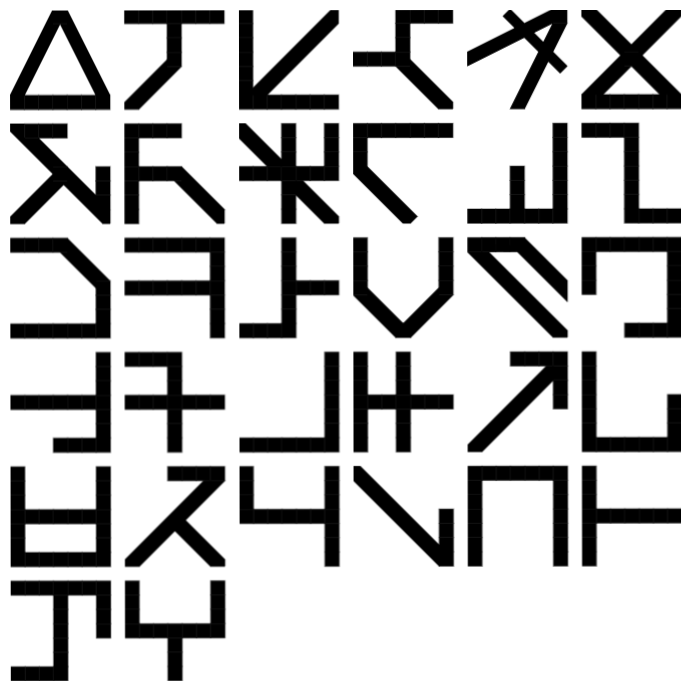

# marainkit/marain

> **Work in progress.** This repo is an active design spec, not a finished project. Expect incomplete sections and frequent changes.

A **deterministic display language** — a rendering grammar where context inputs produce display outputs predictably and consistently.



*© TTFTCUTS — [Marain font](https://fontstruct.com/fontstructions/show/1446008/marain-5)*

```
Input: (type, viewing, status) → tokens + layout rules + emphasis rules
```

Inspired by the Culture novels of Iain M. Banks. This repo is the spec and architecture reference. Implementations live in separate repos under the [marainkit](https://github.com/marainkit) org.

---

## What Marain Is

Marain is the constructed language of the Culture — **engineered rather than evolved**. The Culture's hyperintelligent Minds designed it from scratch to exploit the Sapir-Whorf hypothesis: language shapes society.

**Canonical properties:**
- Written in a **3×3 matrix** of cells, each in one of three states (ternary / base-9)
- Glyphs are **readable in any orientation** — no privileged direction
- Contains a **single gender-neutral third-person pronoun**
- Structured to reduce ambiguity and encode Culture values: egalitarian, non-hierarchical, non-dominant
- **Native medium is tightbeam laser** — a binary bitstream across interstellar space. The glyph system is a *renderer* of that bitstream, not a primary writing system

**Encryption tiers:** M1 (public, all citizens) · M8–M16 (Contact Section) · M32 (Special Circumstances only). This project operates entirely at M1.

**Canonical source:** Banks' essay *"[A Few Notes on Marain](./docs/A_Few_Notes_on_Marain.md)."*

---

## Four-Layer Model

```
┌─────────────────────────────────────────────────────┐
│  LAYER 4 — TRANSMISSION PROTOCOL                    │
│  Tightbeam laser · Bitstream · Parity/error check   │
│  Rotation redundancy · Encryption tier              │
├─────────────────────────────────────────────────────┤
│  LAYER 3 — DATA ENCODING STANDARD                   │
│  9-bit glyph unit · 512 states · Tone as data bits  │
│  Spatial grouping · No privileged direction         │
├─────────────────────────────────────────────────────┤
│  LAYER 2 — CONSTRUCTED LANGUAGE (CONLANG)           │
│  Phoneme set · Abjad structure · Gender-neutral     │
│  pronouns · Non-hierarchical grammar · 5 tones      │
├─────────────────────────────────────────────────────┤
│  LAYER 1 — VISUAL SCRIPT (GLYPH RENDERER)           │
│  3×3 binary grid · Rotation-invariant glyphs        │
│  Macro 3×3 layout · SVG/GIF output                  │
└─────────────────────────────────────────────────────┘
         ↓ all layers produce the same bitstream ↓
```

Binary encoding is canonical. Glyphs are a debug view. Tone and emotional meaning live simultaneously in Layer 2 (conlang) and Layer 3 (encoding) — affect is in the signal itself, not a separate channel.

---

## Subprojects

| Directory | Layer | Purpose | Status |
|-----------|-------|---------|--------|
| `language/` | L2 | Phoneme set, grammar, abjad structure, tonal encoding | Early spec |
| `encoding/` | L1–L3 | Encoding spec: invariant glyphs, layout, base-9 structure | Active spec |
| `display/` | L1 | Adaptive display system: CSS tokens, context model, typography | Prototype built |

**Implementation:** [`marainkit/grey-area`](https://github.com/marainkit/grey-area) — working encoder (text → UTF-8 binary → SVG/GIF). Currently operates at Layer 1 (Column A).

---

## Cross-cutting Principles

- **Token-driven only.** No hardcoded values anywhere in the stack.
- **Legibility first.** Glyph disambiguation required at every layer — visual and encoded.
- **Context is explicit.** Display and behavior adapt to declared context `(type / viewing / status)`, not guesswork.
- **States scale, don't shout.** Warn/critical must be clear but not loud in normal conditions.
- **Escalation = contrast + structure, not color alone.**
- **Structure carries meaning. Decoration does not.**

---

## Display Layer — Context Model

Three axes define the display context:

| Axis | Values |
|------|--------|
| **Type** | `document` · `hud` · `code` · `alert-surface` |
| **Viewing** | `daylight` · `indoor` · `low-light` · `glare-motion` |
| **Status** | `normal` · `attention` · `warn` · `critical` |

Typography is **stable across all modes** — no font swapping per context. Structural differences come from weight, size, and spacing only.

**Fonts locked:** Atkinson Hyperlegible (UI/content) · Intel One Mono (code/tokens)

**Status escalation — base-9 index:** `0–2` neutral · `3–5` attention · `6–7` warning · `8` critical

---

## Encoding Layer — Key Spec Decisions

Full glyph catalogue (canonical, community, and marainkit-derived): [`encoding/docs/glyphs.md`](encoding/docs/glyphs.md)

### Invariant Glyphs

Of 512 possible 3×3 binary states, **8 are fully invariant** under all rotations and mirrors. They divide into two vocabularies:

**Warning (4):** Diamond `#170` · Cross `#186` · Corners `#325` · Checkerboard `#341`

**Structural (4):** Empty `#0` · Point `#16` · Frame `#495` · Full `#511`

These glyphs look different from ordinary text at a glance — exactly as hazard symbols do today. The safety system emerges from geometry, not design convention.

### Layout

Three approaches considered:

1. **Linear** (current in grey-area) — inherited from UTF-8. Works. Un-Culture-like.
2. **Macro 3×3 grid** (recommended) — each cell = one glyph, readable from any edge, maps onto base-9 structure naturally.
3. **Radial / fractal** — intellectually correct for how a Mind would write. Not practical for human readers. Deferred indefinitely.

**Recommended upgrade: Approach 2.** Approach 3 is the ideal; Approach 2 is the pragmatic Culture-correct choice for M1.

Directionality within glyphs is neurological (horizontal scanning is consistent across human cultures). Between glyphs: likely a recommended default (L→R, T→B) rather than mandatory.

---

## Open Questions

**Encoding:**
- Should the 8 invariant glyphs be reserved / visually highlighted in Column A output?
- Implement macro 3×3 layout mode alongside current linear stream?
- Should directionality be a render setting?
- Map invariant glyph vocabulary to display state escalation scale?

**Language:**
- Phoneme set definition (abjad structure) — not yet specified
- Tonal encoding spec: bridge between Layer 2 and Layer 3
- Column B: phoneme picker UI feeding into binary output — the gap no existing tool fills

**Display:**
- `document / low-light / normal` (dark mode) — tokens proposed, not finalized
- `hud / low-light / normal` — not yet built
- `attention` state (between normal and warn) — token and component design

---

## Prior Art

| Project | Notes |
|---------|-------|
| [tomdionysus/marain-font](https://github.com/tomdionysus/marain-font) | TrueType font. Author sent it to Banks via his publishers. |
| [zakalwe2040/marain](https://github.com/zakalwe2040/marain) | Tonal Marain: 5 tones, 24-character abjad, 4×5 dot lattice. Most relevant prior art for Column B. |
| [marain-tools.netlify.app](https://marain-tools.netlify.app/) | Live tool: romanized Marain → glyphs + English gloss. Three input modes including nine-bit binary. |
| Reddit conlang (u/comradelenin456) | Synthetic grammar: flexible word order, no tenses, six cases, fourth-person pronouns. Non-canonical but community-adopted. |

**Why Hindu and Chinese visual influences dominate community interpretations:** structural (Chinese logographic compression, tonal system) and philosophical (Sanskrit as a "designed" sacred language mirrors how Banks frames Marain). The real driver is Banks' committed anti-Eurocentrism — a utopian civilisation that designed its language would draw on non-Western knowledge traditions.

---

## Repo Structure

```
marain/
├── language/           ← linguistic spec (phonemes, grammar, translations)
│   └── CLAUDE.md
├── encoding/           ← encoding spec (invariant glyphs, layout, glyph catalogue)
│   └── docs/
│       ├── glyphs.md           ← known glyph catalogue (canonical + community + marainkit)
│       ├── invariant-glyphs.md
│       └── layout.md
├── display/            ← adaptive display system
│   ├── CLAUDE.md
│   ├── docs/
│   └── themes/culture/ ← working prototype
├── docs/               ← cross-cutting specs
│   ├── marain-layers.md
│   ├── marain-design-notes.md
│   └── Marain_UI_Grammar_v0.1.md
└── Fonts/              ← reference fonts (not tracked in git)
```

**Related repos:**
- [`marainkit/grey-area`](https://github.com/marainkit/grey-area) — encoder implementation (Layer 1, Column A)
