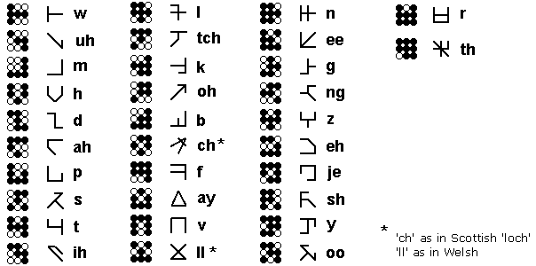

# A Few Notes on Marain

**Iain M. Banks** - *Date unknown*[^1]

---

Marain is a synthetic language created towards the very beginning of the
Culture with the specific intention of providing a means of expression
which would be a culturally inclusive and as encompassingly
comprehensive in its technical and representational possibilities as
practically achievable - a language, in short, that would appeal to
poets, pedants, engineers and programmers alike. The intention was to
start with a linguistic blank sheet, yet with the accumulated knowledge
of the hundreds of thousands known to those people and machines charged
with the language's devising. It had, therefore, no specific links to
any of the main languages spoken by the people who came together to make
up the Culture as a civilisation, save those statistically likely.

*© Iain M. Banks — Marain glyph table, from "A Few Notes on Marain"*

Marain's principle symbols are based around a three-by-three grid, which
is itself a diagrammatic representation of a nine-digit binary number,
or byte, it being intended from the start that the language could be
rendered into binary code as informationally economically as possible.
The number 1 would be shown as in figure 1, while the letter equivalent
to our phoneme "w", the first letter in the Marain alphabet shown in the
list accompanying this text, would be the binary number 100111100, or
121 in base 10. This means that there are a total of 512 possible
values, or symbols, from 0 to 511 (shown in figures 2 and 3
respectively).

The choice of the principle symbols listed here was dictated by the
requirements that each symbol can be rotated and mirrored, without being
mistaken for any other of the primary alphabetical symbols. The rotated
versions of these are generally used to represent phonemes close to the
original, unrotated sound, though others have little in common with the
sound of the original, being used to stand for different vocalisations.
The original idea behind this flexibility was to allow Marain
accurately, and relatively simply, to reproduce any language capable of
being spoken by a humanoid.

All other values of the grid are associated with symbols for numbers (in
base 8), punctuation, and the more common units of measurement, physical
and mathematical symbols and constants, chemical elements and so on.

While the 3×3 grid is the basis of the language's symbols and is the
standard of default mode of Marain, it is only that, and there are
various commonly used complications which increase the length of the
byte. For the normal data transmission purposes, for example, the
principle part of the byte is followed by an additional buffer bit.

Where further complexity is required the binary byte used (ignoring the
buffer bit) can be expanded beyond nine; a ten-bit byte provides a
further 512 symbols, and a twelve bit byte - the most commonly used
value after the standard notary byte due to the relative ease of
representing it as a grid and therefore a written symbol - offers a
total of 4,096 symbols. The next square grid after the 3×3 gird, of
course, is 4×4, offering 65,536 symbols. Larger bytes - and therefore
grids - are generally used to transmit pictograms, culturally alien
symbols and simple diagrams. There is no restriction in principle the
length of the byte and therefore the dimensions of the grid implied; by
specifying a grid of, say, a million bits to a side, a fairly detailed
black and white photograph could in theory be transmitted within a
Marain data stream without recourse to specialised symbols or codes,
though in practise, due to the economies offered by data compression,
this happens only rarely.

It should be noted that while Marain was designed to be as
quintessentially clear, concise and unambiguous a language as it is
within the wit of human and machine to devise - and is, like the best
games, essentially very simple but offering almost infinite
possibilities - experience has proved that the judicious dropping of
buffer bits and the use of varying byte-lengths, usually without the
relevant notification of those mathematical or other pattern, though
just as often not, plus the equally unflagged, abrupt and sporadic
switching to entirely alien binary codes (Morse code being a perfect
example) thankfully enables the Culture Minds fully to indulge their
seemingly congenital predilection of unnecessary obfuscation, wilful
contrariness and the fluent generation of utter and profound confusion
in others.

It should be noted that the "written" symbols in the list are only those
which have become the most used. Obviously in many of the symbols there
are lots of other equally plausible ways to join up the dots. So humans
can use Marain to confuse their fellows, too.

---

[^1]: No definitive publication date or original source has been found.
The essay is mentioned across multiple fan and reference sites but without
a date in any case. Sources consulted: 
- [The Culture Wiki](https://theculture.fandom.com/wiki/A_Few_Notes_on_Marain), 17 FEB 2011
- [trevor-hopkins.com via Web Archive](https://web.archive.org/web/20131029191550/http://trevor-hopkins.com/banks/a-few-notes-on-marain.html), 29 OCT 2013
- [HackerNews](https://news.ycombinator.com/item?id=18704377), 18 DEC 2018
- [LibraryThing](https://www.librarything.com/work/23096751/t/A-Few-Notes-on-Marain-%5Bessay%5D), 26 APR 2022
- [teagmhail.github.io](https://teagmhail.github.io/the-culture/files/A%20Few%20Notes%20on%20Marain%20-%20Iain%20M.%20Banks.pdf), 12 OCT 2025

