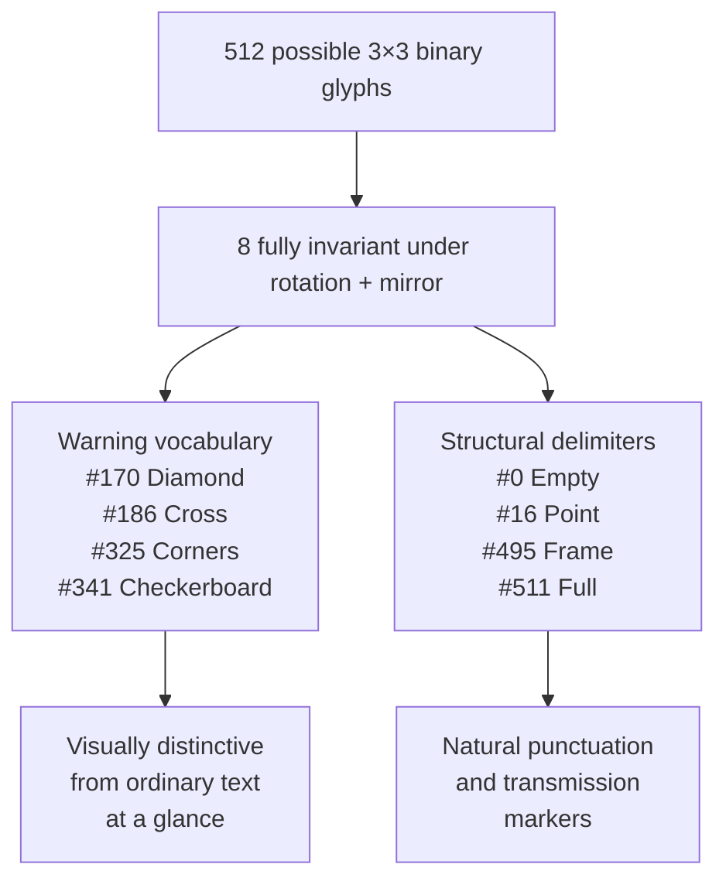

# Marain Design Notes
### GCU Grey Area — marainkit.dev

*Distilled from a design exploration session, March 2026*

---

## 1. What Marain Actually Is

Marain is the constructed language of the Culture — but crucially, it was **engineered rather than evolved**. The Culture's hyperintelligent Minds designed it from scratch to exploit the Sapir-Whorf hypothesis: that language shapes society. Key canonical properties:

- Written in a **3×3 matrix** of cells, each in one of three states (ternary / base-9)
- Glyphs are designed to be **readable in any orientation** — no privileged direction
- Contains a **single gender-neutral third-person pronoun**
- Structured to reduce ambiguity and encode Culture values: egalitarian, non-hierarchical, non-dominant
- Used galaxy-wide as a de facto *lingua franca*

**Encryption tiers:**
- **M1** — basic nonary Marain, 3×3 grid. All Culture citizens can read this.
- **M8–M16** — encrypted variants used by Contact Section
- **M32** — Special Circumstances only, highest encryption

> *This project operates entirely at M1.*

---

## 2. The Native Medium: Tightbeam Laser

The most important reframing: **Marain was designed for transmission, not inscription.**

A tightbeam laser carries a binary bitstream across interstellar space. The 3×3 glyph system is what you get when you *render* that bitstream for human eyes. The script is downstream of the signal.

This means:
- Binary encoding is **canonical**, not a simplification
- Human-readable glyphs are essentially a **debug view** of the transmission
- GCU Grey Area is correctly understood as a **renderer**, not a writing system
- Tone and emotional content baked into the bitstream means affect is **propositional**, not performative

---

## 3. Marain as a Four-Layer System

```
┌─────────────────────────────────────────────────────┐
│  LAYER 4 — TRANSMISSION PROTOCOL                    │
│  Tightbeam laser · Bitstream · Parity/error check   │
│  Rotation redundancy · Encryption tier · Bandwidth  │
├─────────────────────────────────────────────────────┤
│  LAYER 3 — DATA ENCODING STANDARD                   │
│  9-bit glyph unit · 512 states · Tone as data bits  │
│  Spatial grouping · No privileged direction         │
├─────────────────────────────────────────────────────┤
│  LAYER 2 — CONSTRUCTED LANGUAGE (CONLANG)           │
│  Phoneme set · Abjad structure · Gender-neutral     │
│  pronouns · Non-hierarchical grammar · 5 tones      │
├─────────────────────────────────────────────────────┤
│  LAYER 1 — VISUAL SCRIPT (GLYPH RENDERER)           │
│  3×3 binary grid · Rotation-invariant glyphs        │
│  Macro 3×3 layout · SVG/GIF output                  │
│  ← GCU Grey Area currently lives here               │
└─────────────────────────────────────────────────────┘
         ↓ all layers produce the same bitstream ↓
```

**Key insight:** Tone and emotional meaning live simultaneously in Layer 2 (conlang) and Layer 3 (encoding). They are not a separate channel — affect is in the signal itself.

**Column A** of the tool (UTF-8 → binary → glyphs) operates in Layer 1.  
**Column B** (Marain phoneme composition with tonal encoding) would pull in Layer 2.

---

## 4. Layout: The Book Analogy

### Is a linear book layout culturally chauvinistic?

Partly — but defensibly so. The distinction matters:

- **Chauvinistic part:** Assuming "human-readable" implies linear and paginated. Not universal even on Earth — Aztec codices radiate from centres; Chinese classical texts use columnar right-to-left layout; medieval marginalia fight linear flow.
- **Defensible part:** M1 is the tier for ordinary Culture citizens, not Minds. Ordinary Culture citizens still have two forward-facing eyes and a brain hemisphere that strongly prefers sequential processing. Linearity at M1 may be *mammal* chauvinism, not Western chauvinism.
- **Banks' concession:** He wrote the Culture novels in English, in linear prose, for human readers. M1 being somewhat book-like is the same pragmatic concession.

### Ceremonial vs. Density-Optimised

Aztec codices and illuminated manuscripts optimise for **impact**, not density. Size and position encode significance. A civilisation of Minds would consider spatial extravagance a bug — if tone and semantic weight are inside the 9-bit glyph, you don't need theatrical staging. Every cell carries equal weight. This is a **deeply egalitarian property**.

> The book format is correct for M1: practical, dense, unpretentious. Very Culture.

### Directionality

- **Within a glyph:** horizontal scanning is neurological, not cultural — true across all human cultures
- **Between glyphs:** no gravitational anchor for a civilisation operating in zero-g with rotation-invariant symbols
- **Line stacking:** top-to-bottom survives document rotation (becomes bottom-to-top, still readable)

**Likely M1 convention:** a *recommended* default direction (left-to-right, top-to-bottom) rather than a *mandatory* one. The tool should expose direction as a setting.

---

## 5. Three Layout Approaches

```
APPROACH 1: Linear (current)
┌───┬───┬───┬───┬───┬───┐
│ G │ G │ G │ G │ G │ G │ → left to right
└───┴───┴───┴───┴───┴───┘
Inherited from UTF-8. Works. Un-Culture-like.

APPROACH 2: Macro 3×3 Grid (recommended upgrade)
┌───┬───┬───┐
│ G │ G │ G │  Each cell = one 3×3 glyph
├───┼───┼───┤  Readable from any edge
│ G │ G │ G │  Maps cleanly onto base-9 structure
├───┼───┼───┤
│ G │ G │ G │
└───┴───┴───┘

APPROACH 3: Radial / Fractal (Mind-level ideal)
        G
      G   G
    G   G   G    Radiates from centre
      G   G      No start, no end
        G         How a Mind would write it
```

The practical sweet spot for this project: **Approach 2**.

---

## 6. The 8 Invariant Glyphs

Of 512 possible 3×3 binary states, only **8** are fully invariant under all rotations (0°, 90°, 180°, 270°) and mirrors. These are mathematically guaranteed to read identically from any orientation.

They divide naturally into two vocabularies:

### Warning Vocabulary (4 glyphs)

| Code | Name | Role | Meaning | Pattern |
|------|------|------|---------|---------|
| `#170` | **Diamond** | warning | danger / hazard | `░█░` `█░█` `░█░` |
| `#186` | **Cross** | warning | alert / stop | `░█░` `███` `░█░` |
| `#325` | **Corners** | warning | boundary / perimeter warning | `█░█` `░░░` `█░█` |
| `#341` | **Checkerboard** | warning | noise / maximum intensity | `█░█` `░█░` `█░█` |

### Structural Delimiters (4 glyphs)

| Code | Name | Role | Meaning | Pattern |
|------|------|------|---------|---------|
| `#0` | **Empty** | structural | silence / null / word space | `░░░` `░░░` `░░░` |
| `#16` | **Point** | structural | singularity / decimal point | `░░░` `░█░` `░░░` |
| `#495` | **Frame** | structural | enclosure / bracket / container | `███` `█░█` `███` |
| `#511` | **Full** | structural | full stop / header marker / maximum | `███` `███` `███` |

### Key implications

1. **These glyphs look different from ordinary text at a glance** — exactly as hazard symbols do today. A reader approaching a Marain document from any direction sees warning glyphs before decoding a single word.
2. **The pairs are semantic inverses:** Empty↔Full (silence/maximum), Point↔Frame (one pixel/everything-but-one-pixel)
3. **The safety system emerges from geometry**, not design convention. It requires no enforcement.
4. **HIGH IMPACT CONTENT** (WARNING: RADIATION) is readable from any orientation by design — this is not incidental.



---

## 7. Community Marain Context

- **Canonical source:** Banks' essay *"A Few Notes on Marain"* — describes glyphs, pronunciation, data transmission
- **Reddit conlang** (u/comradelenin456, u/ratioprosperous): synthetic language built on Banks' alphabet. Flexible word order, no tenses, six grammatical cases, fourth-person pronouns, genderless third-person. Non-canonical but community-adopted.
- **Tonal Marain** (zakalwe2040/marain on GitHub): adds five emotional tones (Mandarin-derived), 24-character abjad, 4×5 dot lattice divided into diacritic channels + 3×3 slate. Most relevant prior art for Column B.
- **marain-tools.netlify.app**: live tool mapping English phonemes to Marain glyphs. Reference for authentic phonemic approach.

### Why Hindu and Chinese visual influences dominate community interpretations

- **Chinese:** Structural — tonal system, logographic compression, contained character-as-unit. zakalwe2040 makes this explicit with Mandarin tone names.
- **Hindu/Sanskrit:** Philosophical — ternary triadic thinking maps onto Hindu cosmology; Sanskrit's prestige as a "designed" sacred language with systematic phonology mirrors how Banks frames Marain.
- **The real driver:** Banks' committed anti-Eurocentrism. A utopian civilisation that *designed* its language would draw on non-Western knowledge traditions. The community correctly reads this signal.

---

## 8. Open Design Questions

- [ ] Should directionality be a render setting in GCU Grey Area?
- [ ] Should the 8 invariant glyphs be reserved / highlighted in Column A output?
- [ ] Column B implementation: phoneme picker UI + tonal encoding
- [ ] Macro 3×3 layout mode vs. current linear stream
- [ ] Gap no one has filled: tool that lets you compose in Marain phonemes *and* see the exact bits being generated — bridge between Layer 2 and Layer 3

---

## 9. Project Scope Reminder

> GCU Grey Area is a **renderer** — a way of visualising what a tightbeam signal looks like when laid out spatially. Column A encodes arbitrary UTF-8 text. Column B will compose in Marain phonemes with tonal encoding. Both produce the same binary output format. The tool sits at the intersection of conlang, data encoding standard, visual script, and transmission protocol — an unusual and genuinely interesting place to build from.

---

*marainkit.dev · tools built around Marain, not a claim on it*
