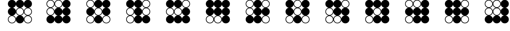
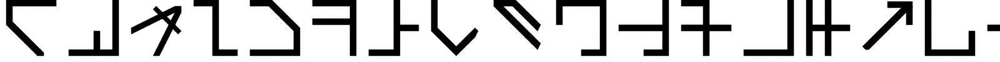
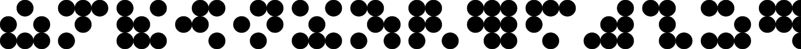
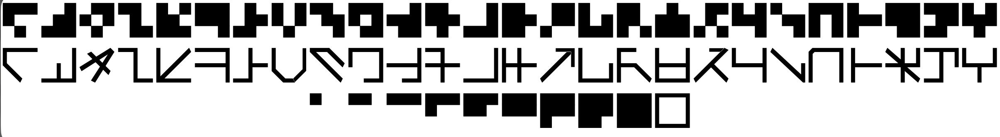
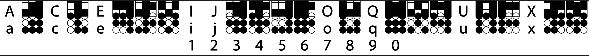
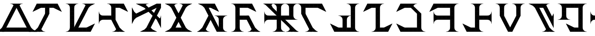
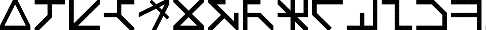
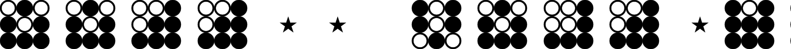
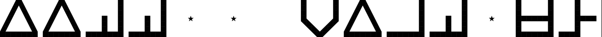
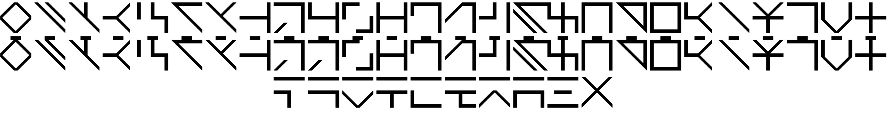

# Marain Resources

## Implementations and tools

- [Tonal Marain](https://github.com/zakalwe2040/marain) — Tonal Marain: a 24-consonant abjad, numeral system, and operator notation, rendered as SVG glyph diagrams; uses a 4×5 lattice extending the M1 3×3 grid

## Translation
- [New Marian Translator](https://lingojam.com/NewMarianTranslator\(Updated\)) — Replaces common english words with their Marian counterparts in English
- [Marian Tools](https://marain-tools.netlify.app/?SC) — Translates English words into their Marian phonetic glyphs. Also includes an English to Marain dictionary
- [Marian](https://github.com/DavidWeichselbaum/marain) — Encodes whole sentences in a single human-learnable symbolic glyph using an recurrent neural network autoencoder. Written in python

## Primary sources

- [A Few Notes on Marain](source/a-few-notes-on-marain.md) — Iain M. Banks' original canonical essay describing Marain's design — its 3×3 binary glyph system, phonology, and cultural intent.

## Existing Fonts

- [marain-Anjoki01](https://fontstruct.com/fontstructions/show/2380807)
  - Another dots version, reminiscant of Marain-Dot-Velh by Anjoki01

- [marain-2-Anjoki01](https://fontstruct.com/fontstructions/show/2738804)
  - A thinner version of standard Marian by Anjoki01

- [marain-dots-TTFTCUTS](https://fontstruct.com/fontstructors/1476779/ttftcuts)
  - Monospace OpenType face echoing Banks' original design by TTFTCUTS

- [marain-font-tomdionysus](https://github.com/tomdionysus/marain-font)
  - Implements Banks' vision of a phoneme alphabet

- [marain-script-DanielSolis](https://www.patreon.com/posts/marain-font-134954490)
  - Somehow, this looks like Korean to me by Daniel Solis. gif only.

- [marain-serif-comradelenin456](https://fontstruct.com/fontstructions/show/1562513/marain-serif-1)
  - A very Klingonesque Marain by comradelenin456

- [marain-tomcully](https://web.archive.org/web/20070128013856/http://www.tomcully.com/marain.htm)
  - A very early, blocky version by tomcullyvia Web Archive

- [marain-with-punctuation-conlanger56](https://fontstruct.com/fontstructions/show/1508418/marain-with-punctuation-and-numerals)
  - Blocky version with nice spacing by conlanger56

--- 

### [Marain Dot Velh](https://fontstruct.com/fontstructions/show/2147046/marain-dot-velh)
Marain dot matching the keyboard alignment used by Daniel Solis for Marain Ancient by Velh

### [Marain](https://fontstruct.com/fontstructions/show/1446008/marain-5)

### [Marain-Velh](https://fontstruct.com/fontstructions/show/2147116/marain-velh)

### [Marain](https://fontstruct.com/fontstructions/show/2380807/marain-11)

### [marain-regular-bianc0niglio](https://fonts2u.com/marain-regular.font)

### [Marian Ancient](https://danielsolisblog.blogspot.com/2010/12/free-font-marain-ancient.html)
A face based on Herculanum by Daniel Solis. [Video](https://www.youtube.com/watch?v=LvgJAxN64Tk)

### [Marain Script](https://danielsolisblog.blogspot.com/2010/09/free-font-marain-script.html)
Another ancient alien version of Marain by Daniel Solis. gif only.
